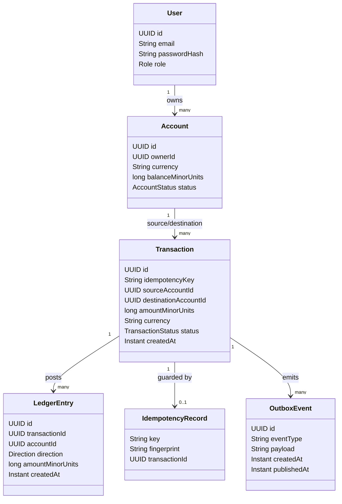

# Domain Model

Status: Phase 0 — design only, no code exists yet.

## 1. Bounded contexts / aggregates

PaymentFlow is organized around four core aggregates, each owned by one module
(see `docs/architecture/modular-monolith.md`):

- **Identity** — `User`. Owns authentication and role (CUSTOMER/ADMIN).
- **Account** — `Account`. Owns the current balance read model and ownership.
- **Payment** — `PaymentRequest` / `Transaction`. Orchestrates a transfer between two
  accounts, owns idempotency.
- **Ledger** — `LedgerEntry`. The append-only source of truth for money movement.

## 2. Entities and invariants

### User (Identity)
- Identity: `id` (UUID), `email` (unique), `passwordHash`, `role` (CUSTOMER | ADMIN).
- Invariant: email is unique and immutable after creation.

### Account (Account)
- Identity: `id` (UUID), `ownerId` (User), `currency`, `balanceMinorUnits`,
  `status` (ACTIVE | FROZEN | CLOSED).
- Invariant: `balanceMinorUnits >= minimumAllowedBalance` (0 for a standard account) at
  all times, enforced both by application logic and a DB `CHECK` constraint.
- Invariant: `balanceMinorUnits` is a **read model** — it must always be reconstructible
  as `SUM(ledger_entries.amount_minor_units)` for that account. It exists for fast reads,
  not as the system of record.
- Invariant: money is represented as an integer count of minor units (cents), never as
  floating point (see `docs/database/schema.md` §"Money representation").

### PaymentRequest / Transaction (Payment)
- Identity: `id` (UUID), `idempotencyKey` (unique per initiating user), `sourceAccountId`,
  `destinationAccountId`, `amountMinorUnits`, `currency`, `status`
  (PENDING | COMPLETED | FAILED | REJECTED), `createdAt`.
- Invariant: `sourceAccountId != destinationAccountId`.
- Invariant: `amountMinorUnits > 0`.
- Invariant: a given `(userId, idempotencyKey)` pair maps to exactly one logical
  transaction outcome, regardless of how many times the request is retried.
- Invariant: a transaction transitions COMPLETED at most once; ledger entries are only
  ever written on that single transition (no partial/duplicate postings).

### LedgerEntry (Ledger)
- Identity: `id` (UUID), `transactionId`, `accountId`, `direction` (DEBIT | CREDIT),
  `amountMinorUnits`, `createdAt`.
- Invariant: **immutable** — no update, no delete, ever. Corrections are new reversing
  entries referencing the original transaction.
- Invariant: for any `transactionId`, `SUM(amount where direction=DEBIT) ==
  SUM(amount where direction=CREDIT)` (double-entry balance).
- Invariant: every `LedgerEntry` belongs to exactly one `Transaction`; a `Transaction`
  that reached COMPLETED has exactly two entries in the simple transfer case (one debit,
  one credit) — richer cases (fees, splits) may add more, still balanced.

### Supporting concepts
- **IdempotencyKey record** — persisted alongside the transaction it produced, storing a
  fingerprint of the request body so a replay with a different payload is rejected
  (422), following the pattern demonstrated in `postgres-concurrency-control`
  (`IdempotentPayoutService`).
- **OutboxEvent** — a row written in the same DB transaction as the ledger postings,
  later published to Kafka by a separate poller/publisher (Phase 4+). Guarantees
  at-least-once delivery without a distributed transaction.

## 3. Aggregate boundaries and consistency

- `Account.balanceMinorUnits` and the `LedgerEntry` rows for a transfer are written in the
  **same** database transaction as the `Transaction` status change to COMPLETED —
  strong consistency within one DB transaction, no eventual consistency for the core
  money movement.
- Publishing to Kafka (outbox) is **eventually consistent** by design — consumers may see
  the event slightly after the transaction commits, which is acceptable because nothing
  financial depends on Kafka (see AGENTS.md invariant: "no financial correctness depends
  on Redis" — the same principle extends to Kafka for the core ledger).

## 4. Mermaid class diagram

