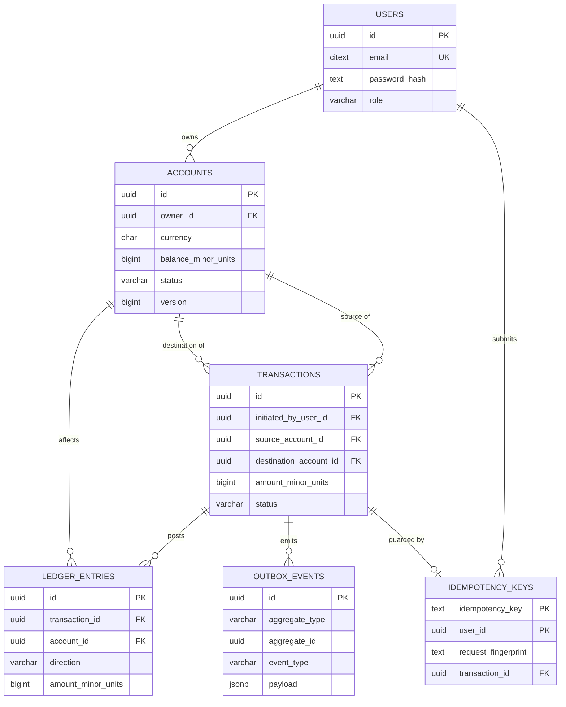

# Database Schema (Initial Design)

Status: Phase 0 — documentation only. No Flyway migration files exist yet; these will be
authored in Phase 1 as `V1__init.sql`, etc., per AGENTS.md ("Flyway only").

## 1. Money representation — decision

**Decision: `BIGINT` storing minor units (cents), not `NUMERIC(19,4)`.**

Justification:
- Minor-units integers avoid any possibility of floating-point representation error and
  avoid the (smaller, but real) risk of `NUMERIC` rounding surprises across arithmetic in
  application code if a developer accidentally maps it to a Java `double`.
- `BIGINT` arithmetic (`+`, `-`) in both PostgreSQL and Java (`long`) is exact and fast.
- The `postgres-concurrency-control` reference project uses `BigDecimal`/`NUMERIC(19,2)`
  successfully — that is also a valid, defensible choice. We diverge here specifically
  because PaymentFlow's ledger does heavy summation (`SUM()` over many rows to derive
  balances), where integer minor units keep aggregation trivially exact and avoid needing
  a `RoundingMode` policy anywhere in the codebase.
- Currency's minor-unit exponent (2 for EUR/USD) is applied only at presentation
  boundaries (API responses format `amountMinorUnits / 100` for display).
- Column name convention: every money column is suffixed `_minor_units`.

This is a Phase 0 decision, not yet validated against real code — revisit if the
minor-units convention proves error-prone in Phase 1 implementation.

## 2. Tables

```sql
-- ============================================================
-- users
-- ============================================================
CREATE TABLE users (
    id              UUID PRIMARY KEY DEFAULT gen_random_uuid(),
    email           CITEXT NOT NULL UNIQUE,
    password_hash   TEXT NOT NULL,
    role            VARCHAR(16) NOT NULL CHECK (role IN ('CUSTOMER', 'ADMIN')),
    created_at      TIMESTAMPTZ NOT NULL DEFAULT now(),
    updated_at      TIMESTAMPTZ NOT NULL DEFAULT now()
);

-- ============================================================
-- accounts
-- ============================================================
CREATE TABLE accounts (
    id                     UUID PRIMARY KEY DEFAULT gen_random_uuid(),
    owner_id               UUID NOT NULL REFERENCES users(id),
    currency               CHAR(3) NOT NULL,
    balance_minor_units    BIGINT NOT NULL DEFAULT 0,
    status                 VARCHAR(16) NOT NULL DEFAULT 'ACTIVE'
                               CHECK (status IN ('ACTIVE', 'FROZEN', 'CLOSED')),
    version                BIGINT NOT NULL DEFAULT 0,   -- optimistic locking (ADR-004)
    created_at             TIMESTAMPTZ NOT NULL DEFAULT now(),
    updated_at             TIMESTAMPTZ NOT NULL DEFAULT now(),
    CONSTRAINT chk_accounts_balance_non_negative CHECK (balance_minor_units >= 0)
);

CREATE INDEX idx_accounts_owner_id ON accounts (owner_id);

-- ============================================================
-- transactions  (one row per payment attempt/outcome)
-- ============================================================
CREATE TABLE transactions (
    id                       UUID PRIMARY KEY DEFAULT gen_random_uuid(),
    initiated_by_user_id     UUID NOT NULL REFERENCES users(id),
    source_account_id        UUID NOT NULL REFERENCES accounts(id),
    destination_account_id   UUID NOT NULL REFERENCES accounts(id),
    amount_minor_units       BIGINT NOT NULL,
    currency                 CHAR(3) NOT NULL,
    status                   VARCHAR(16) NOT NULL DEFAULT 'PENDING'
                                 CHECK (status IN ('PENDING', 'COMPLETED', 'FAILED', 'REJECTED')),
    failure_reason           TEXT,
    created_at               TIMESTAMPTZ NOT NULL DEFAULT now(),
    completed_at             TIMESTAMPTZ,
    CONSTRAINT chk_txn_amount_positive CHECK (amount_minor_units > 0),
    CONSTRAINT chk_txn_distinct_accounts CHECK (source_account_id <> destination_account_id)
);

CREATE INDEX idx_transactions_source_account ON transactions (source_account_id, created_at DESC);
CREATE INDEX idx_transactions_destination_account ON transactions (destination_account_id, created_at DESC);

-- ============================================================
-- ledger_entries  (append-only, immutable double-entry postings)
-- ============================================================
CREATE TABLE ledger_entries (
    id                   UUID PRIMARY KEY DEFAULT gen_random_uuid(),
    transaction_id       UUID NOT NULL REFERENCES transactions(id),
    account_id           UUID NOT NULL REFERENCES accounts(id),
    direction            VARCHAR(6) NOT NULL CHECK (direction IN ('DEBIT', 'CREDIT')),
    amount_minor_units   BIGINT NOT NULL CHECK (amount_minor_units > 0),
    created_at           TIMESTAMPTZ NOT NULL DEFAULT now()
    -- No updated_at, no UPDATE/DELETE grants at the application role level: immutability
    -- is enforced at the DB privilege level in Phase 1, not just by convention.
);

CREATE INDEX idx_ledger_entries_account_id ON ledger_entries (account_id, created_at DESC);
CREATE INDEX idx_ledger_entries_transaction_id ON ledger_entries (transaction_id);

-- ============================================================
-- idempotency_keys
-- ============================================================
CREATE TABLE idempotency_keys (
    idempotency_key      TEXT NOT NULL,
    user_id              UUID NOT NULL REFERENCES users(id),
    request_fingerprint  TEXT NOT NULL,      -- hash of the normalized request body
    transaction_id       UUID REFERENCES transactions(id),
    created_at           TIMESTAMPTZ NOT NULL DEFAULT now(),
    PRIMARY KEY (user_id, idempotency_key)
);

-- ============================================================
-- outbox_events
-- ============================================================
CREATE TABLE outbox_events (
    id             UUID PRIMARY KEY DEFAULT gen_random_uuid(),
    aggregate_type VARCHAR(64) NOT NULL,     -- e.g. 'Transaction'
    aggregate_id   UUID NOT NULL,
    event_type     VARCHAR(64) NOT NULL,     -- e.g. 'PaymentCompleted'
    payload        JSONB NOT NULL,
    created_at     TIMESTAMPTZ NOT NULL DEFAULT now(),
    published_at   TIMESTAMPTZ
);

CREATE INDEX idx_outbox_unpublished ON outbox_events (created_at) WHERE published_at IS NULL;
```

## 3. Open question (flagged for the user before Phase 1)

**Should `transactions` and `ledger_entries` remain two tables, or be merged?**

Two-table design (above) is recommended for Phase 0 because:
- `transactions` represents the *intent/attempt* (including PENDING/FAILED/REJECTED
  states that never produce ledger postings).
- `ledger_entries` represents only *actual, immutable, balanced postings*.
- Keeping them separate lets `ledger_entries` stay a pure, append-only, never-updated
  table (simpler integrity story, simpler to eventually partition by `created_at` as in
  the `postgres-concurrency-control` write-vs-read partitioning pattern), while
  `transactions` can carry mutable-until-terminal status.

This is called out explicitly as **not yet decided** — an alternative single-table design
(status + entries collapsed) trades simplicity for mixing mutable and immutable
concerns in one table. Confirm before Phase 1 migration authoring.

## 4. Indexes we will add later, and why (deferred until evidenced)

Per the project rule of not adding indexes speculatively (evidence-driven indexing, as
demonstrated by `WriteVsReadSchemaTest` and the `EXPLAIN ANALYZE` workflow in
`postgres-concurrency-control`), the following are **candidates only**, to be added in
Phase 2/3 once a query plan or benchmark justifies them:

- A composite index on `transactions (initiated_by_user_id, created_at DESC, id)` to
  support cursor-paginated "my transaction history" if the existing per-account indexes
  prove insufficient.
- A covering index (`INCLUDE`) on `ledger_entries (account_id, created_at)` including
  `amount_minor_units, direction` if balance-reconstruction queries show heap fetches in
  `EXPLAIN ANALYZE`.
- Range partitioning of `ledger_entries` by `created_at` (monthly) once row counts make
  vacuum/index size a measured problem — mirrors the `audit_event` partitioning pattern
  in `postgres-concurrency-control` §7. Not done until evidenced (see
  `docs/system-design/scaling-evolution.md`).
- A partial index on `outbox_events (created_at) WHERE published_at IS NULL` is included
  above pre-emptively because the publisher's poll query pattern is already known and
  fixed (small, self-cleaning working set) — this is the one exception to "wait for
  evidence" because the access pattern, not a guess, dictates it.

## 5. Mermaid ER diagram


