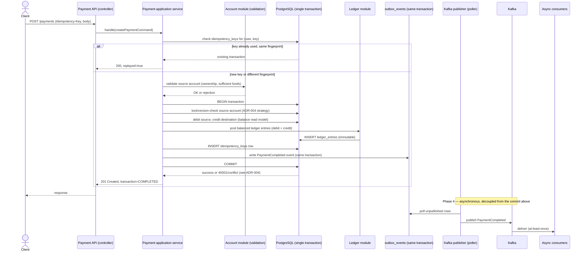

# Payment Sequence Diagram

Status: Phase 0. Describes the target flow for `POST /payments`; nothing below is
implemented yet.

## Explanation

- **Client → API → Payment application service → Account validation → PostgreSQL
  transaction → Ledger → Outbox → Commit** is all **Phase 1**, and all inside **one**
  database transaction: the balance update, the ledger postings, the idempotency-key
  insert, and the outbox row are committed atomically or not at all. This is the same
  "store the key in the same transaction as the operation" principle demonstrated by
  `IdempotentPayoutService` in `postgres-concurrency-control`.
- The **lock/version-check** step is where ADR-004's chosen concurrency strategy applies
  (optimistic `@Version` check, `SELECT ... FOR UPDATE`, or `SERIALIZABLE` — see
  `docs/architecture/concurrency-strategy.md`). A conflict here surfaces to the client as
  `409` (retryable) or `422` (business rejection), matching the HTTP semantics documented
  in `postgres-concurrency-control`.
- **Kafka publisher → Kafka → consumers** is **Phase 4**, drawn with a note to mark it
  explicitly decoupled and asynchronous — a slow or down consumer never blocks or reverses
  a committed payment.
- Retrying the whole request with the same `Idempotency-Key` re-enters this flow at the
  "check idempotency_keys" step and short-circuits to a replayed response, never
  re-executing the debit/credit.
