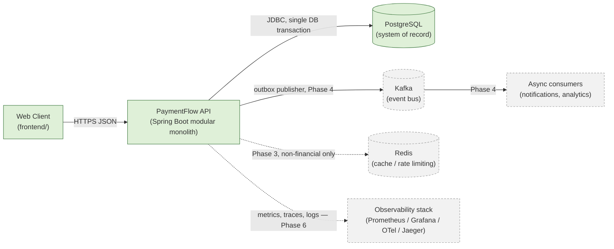

# System Context Diagram

Status: Phase 0. Nothing in this diagram is deployed; it documents the target shape.

## Explanation

- **Client → API → PostgreSQL** (solid, green) is the **Phase 1** core: a single Spring
  Boot application talking to one PostgreSQL database. This is the only path required for
  the core FRs in `docs/architecture/scope.md` (open accounts, transfer money, prevent
  overdraft, view history).
- **Kafka + async consumers** (dashed, grey) are introduced in **Phase 4** as the delivery
  mechanism for the transactional outbox (`outbox_events` table, already documented in
  `docs/database/schema.md`). Nothing financial depends on Kafka being up — a stalled
  publisher delays notifications, never a balance.
- **Redis** (dashed) is introduced in **Phase 3** at the earliest, strictly for
  non-financial concerns (e.g. rate limiting login attempts, caching read-only reference
  data). Per AGENTS.md: no financial correctness may ever depend on Redis.
- **Observability stack** (dashed) is **Phase 6** — metrics/tracing/logging wiring, see
  `docs/system-design/observability-roadmap.md`. It observes the system; it is never on
  the critical path of a payment.
